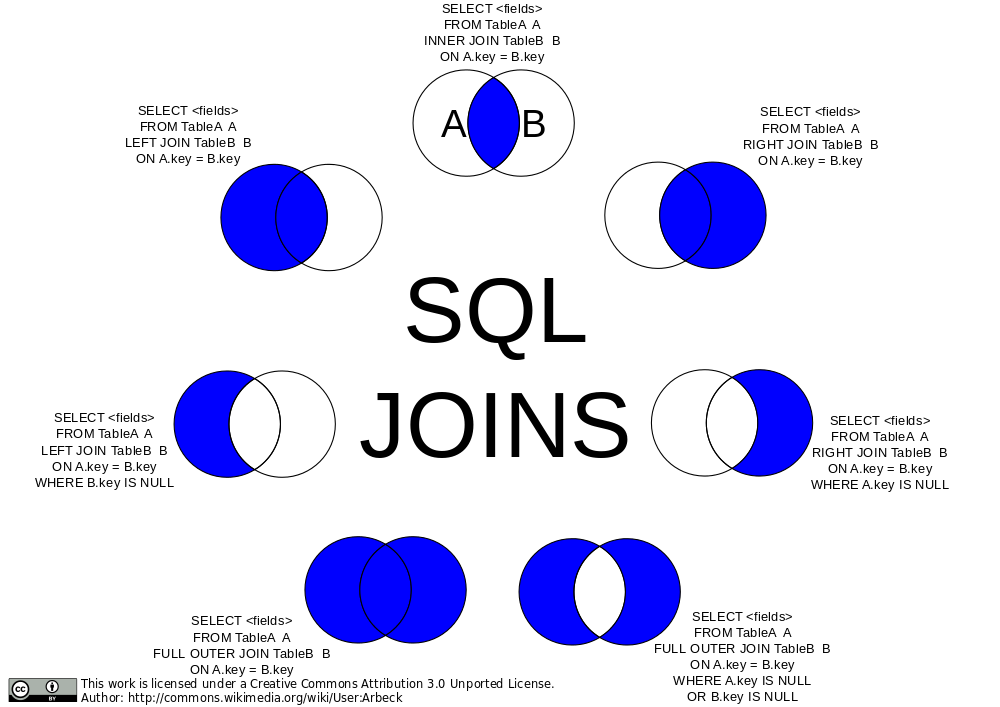

Let's get into some more complicated querying. First thing we're going to need is two more tables, comments and boards. We'll be making the data structure for a very simple message board system that has users, comments, and boards. The interesting part here is that every comment is posted by a user and therefore will need to reference the user table, and it will be posted to board and therefore will need to reference a board from the boards table. This is what you would call relational data and where relational databases really shine.

## Foreign Keys

Let's jot down all of our schemas for our users, boards, and comments.

```sql

CREATE TABLE users (
  user_id INTEGER PRIMARY KEY GENERATED ALWAYS AS IDENTITY,
  username VARCHAR ( 25 ) UNIQUE NOT NULL,
  email VARCHAR ( 50 ) UNIQUE NOT NULL,
  full_name VARCHAR ( 100 ) NOT NULL,
  last_login TIMESTAMP,
  created_on TIMESTAMP NOT NULL
);

CREATE TABLE boards (
  board_id INTEGER PRIMARY KEY GENERATED ALWAYS AS IDENTITY,
  board_name VARCHAR ( 50 ) UNIQUE NOT NULL,
  board_description TEXT NOT NULL
);

CREATE TABLE comments (
  comment_id INTEGER PRIMARY KEY GENERATED ALWAYS AS IDENTITY,
  user_id INT REFERENCES users(user_id) ON DELETE CASCADE,
  board_id INT REFERENCES boards(board_id) ON DELETE CASCADE,
  comment TEXT NOT NULL,
  time TIMESTAMP
);

```

- The first two should look pretty familiar. The only new-ish thing is the user of the `TEXT` data type. This is basically a VARCHAR with no cap (or rather a very large cap.) It has some other small differences but for now just know it's uncapped text.
- `user_id INT REFERENCES users(user_id)` is technically all you need to make a foreign key. The first part, `INT`, makes it known that this key will be stored as an integer. It then uses the `REFERENCES` key word to let PostgreSQL know that it is a foreign key. A foreign key is a field in one table that references the **primary** key of another table. In this case, a comment will reference the user_id in another table, the users table. The `users` part say it's reference the users table and the `(user_id)` is the name of the key in the other table. In this case, we called both user_id (which will probably happen somewhat frequently but not always) so they match but if we had called the user_id just id in the users table, we'd put `id` there.
- `ON DELETE CASCADE` lets PostgreSQL know what to do if the user gets deleted. So if a user makes a comment on the message board and then deletes their account, what do you want it to do? If you omit the `ON DELETE CASCADE` part, it's the same as doing `ON DELETE NO ACTION` which means it'll just error and not let you delete the user until you've deleted all the comments first. You can also do `ON DELETE SET NULL` which means it'll make the user_id null on any comment that was made by that user.
- We've dne the same for board_id, just referencing the boards table instead of the users table.

Let's go ahead and put some dummy data in there. Copy / paste [this query] into your psql terminal. It may take a few minutes.

## JOIN

So a user goes to your message board and click

```sql
SELECT comment_id, user_id, LEFT(comment, 20) AS preview FROM comments WHERE board_id = 39;
```

- Two new things here. The `LEFT` function will return the first X characters of a string (as you can guess, RIGHT returns the last X charcters). We'r doing this because this hard to read otherwise in the command line.
- The `AS` keyword lets you rename how the string is projected. If we don't use AS here, the string will be returned under they key `left` which doesn't make sense.

Okay so you'll get something back like this:

```
 comment_id | user_id |       preview
------------+---------+----------------------
         63 |     858 | Maecenas tristique,
        358 |     876 | Mauris enim leo, rho
        429 |     789 | Maecenas ut massa qu
        463 |     925 | Phasellus sit amet e
        485 |     112 | Maecenas tristique,
        540 |     588 | Nullam porttitor lac
        545 |     587 | Praesent id massa id
        972 |     998 | Aenean lectus. Pelle
(8 rows)
```

We can't really use this to display the comments on our web app because your users don't care what user_id posted these comments, they want the username. But that doesn't live in the comments table, that exists in the users table. So how do we connect those together?

```sql
SELECT
  comment_id, comments.user_id, users.username, time, LEFT(comment, 20) AS preview
FROM
  comments
INNER JOIN
  users
ON
  comments.user_id = users.user_id
WHERE
  board_id = 39;
```

Magic! The big key here is the `INNER JOIN` which allows us to match up all the keys from one table to another. We do that in `ON` clause where we say user*ids match is where you can \_join* together those records into one record.

Let's talk about `INNER` for a second. There are multiple kinds of JOINs. INNER is a good one start with. It says "find where user_ids match. If you find a record where the user_id exists in one but not in the other, omit it in the results." This isn't a particularly useful distinction for us right now becase all user_ids will exist in users and we're assured of that due to the foreign key restraints we used. However if a comment had a user_id that didn't exist, it would omit that comment in the results.

[](https://commons.wikimedia.org/wiki/File:SQL_Joins.svg)

A `LEFT JOIN` would say "if a comment has a user_id that doesn't exist, include it anyway." A `RIGHT JOIN` wouldn't make much sense here but it would include users even if they didn't have a comment on that board.

We can also an `OUTER JOIN` which would be everything that _doesn't match_. In our database, that would be nothing because we're guaranteed everything has match due to our constraints.

You can also do a `FULL OUTER JOIN` which says just include everything. If it doesn't have a match from either side, include it. If it does have a match, include it.

Another rarely useful join is the `CROSS JOIN`. This gives the _Cartesian product_ of the two tables which can be enormous. A Cartesian product would be every row matched with every other row in the other table. If you have A, B, and C in one table with D and E in the other, your CROSS JOIN would be AD, AE, BD, BE, CD, an CE. If you do a cross join between two tables with 1,000 rows each, you'd get 1,000,000 records back.

Tables can also be self-joined. Imagine you have a table of employees and one of the fields is direct_reports which contains employee_ids of employees that report the original employee. You could do a SELF JOIN to get the information for the reports.

Honestly 95% of what I do is covered by INNER and LEFT joins.

One neat trick we could do here is a NATURAL JOIN.

```sql
SELECT
  comment_id, comments.user_id, users.username, time, LEFT(comment, 20) AS preview
FROM
  comments
NATURAL INNER JOIN
  users
WHERE
  board_id = 39;
```

This will work like it did above. NATURAL JOIN tells PostgreSQL "I named things the same in both tables, go ahead and match it together yourself. This is fun when it lines up but I don't often end up using it myself. And in the end it's often better to be explicit what about your intent is for joins. So use cautiously and/or for neat party tricks.

## Subqueries

Let's say you need to find all the comments made by Maynord Simonich. You could make two queries: query for Kate's user_id from users, and then use that user_id to query comments. Or we could do it all at once with a subquery!

```sql
SELECT comment_id, user_id, LEFT(comment, 20) FROM comments WHERE user_id = (SELECT user_id FROM users WHERE full_name = 'Maynord Simonich');
```

This will query for Maynord's ID and immediately use that in the other query. Make sure this returns exactly one row or this will fail. You can use subqueries in a variety of ways but it generally looks like this with `()` surrounding the subqueries. You can even have subqueries in your subqueries!

## GROUP BY

What if you were making a report and you wanted to show the top ten most posted-to message boards? You could run something like this.

```sql
SELECT
  boards.board_name, COUNT(*) AS comment_count
FROM
  comments
INNER JOIN
  boards
ON
  boards.board_id = comments.board_id
GROUP BY
  boards.board_name
ORDER BY
  comment_count DESC
LIMIT 10;
```

`GROUP BY` is going to collapse all the same board_names (guaranteed unique due to our UNIQUE constraint on the board) and then we use the `COUNT(*)` to count how many boards have that same `board_name`. So this works! This will give us the precise number of comments on the top board!

Now what if you wanted to see the boards that were the least populated? We could just flip the `ORDER BY` to `ASC` but there's a distinct problem here: what happens if there's no post on a board?

```sql
SELECT
  boards.board_name, COUNT(*) AS comment_count
FROM
  comments
INNER JOIN
  boards
ON
  boards.board_id = comments.board_id
GROUP BY
  boards.board_name
ORDER BY
  comment_count ASC
LIMIT 10;
```

It wouldn't show up because of the `INNER JOIN`. So what do we need? Well, the "LEFT" board here is the comments (the one that's in the FROM will be LEFT) and we don't need anything more from the comments board since all of them will show up in the query thanks to the foreign key constraints. So then we need a RIGHT JOIN! We need to include boards that don't have any comments. We also need to change `COUNT(*)` because any row counts for a `*` and that would make it look like there was one comment on our empty boards when in reality there was zero. We need therefore it to be `COUNT(comment_id)` because that will actually count how many comments exist.

```sql
SELECT
  boards.board_name, COUNT(comment_id) AS comment_count
FROM
  comments
RIGHT JOIN
  boards
ON
  boards.board_id = comments.board_id
GROUP BY
  boards.board_name
ORDER BY
  comment_count;
```

Tricky! It's important to know your data, what you expect to see, and be aware of the constraints of your queries!
