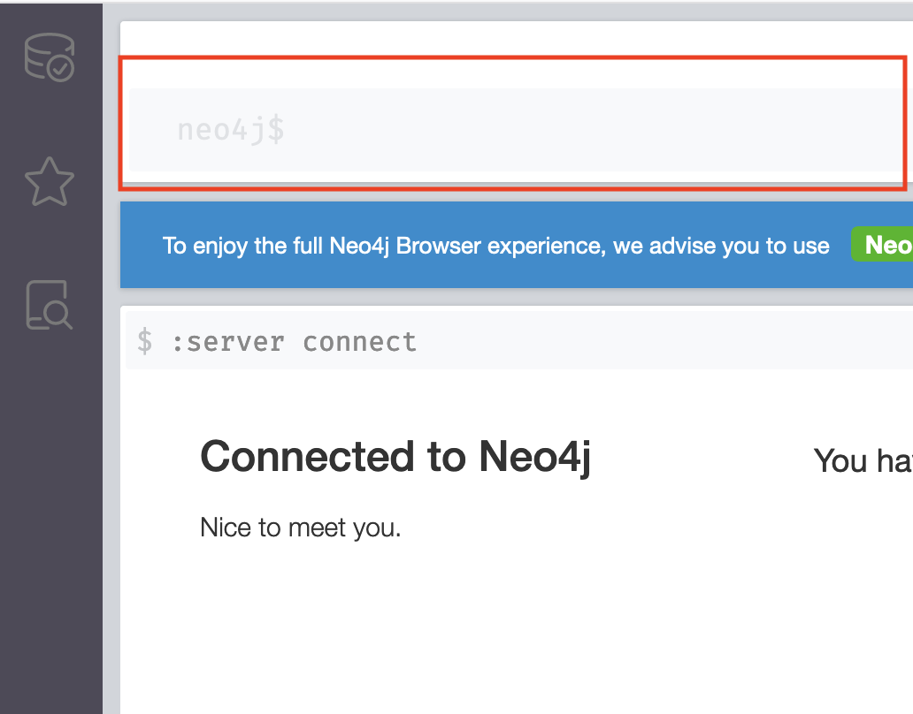
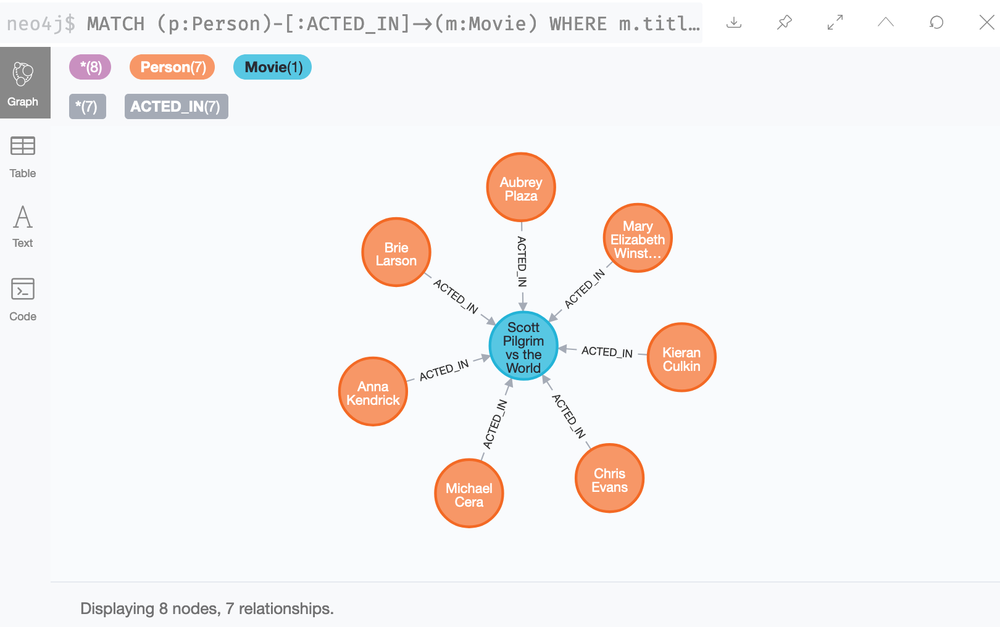
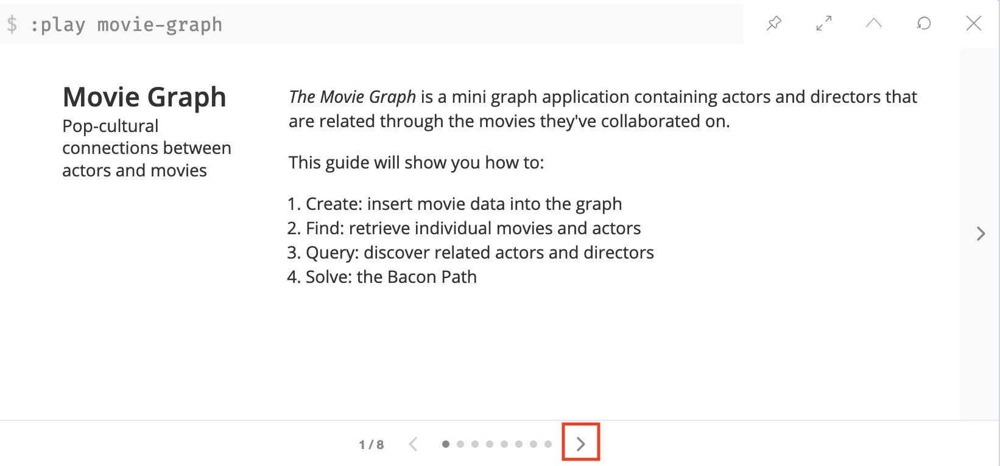
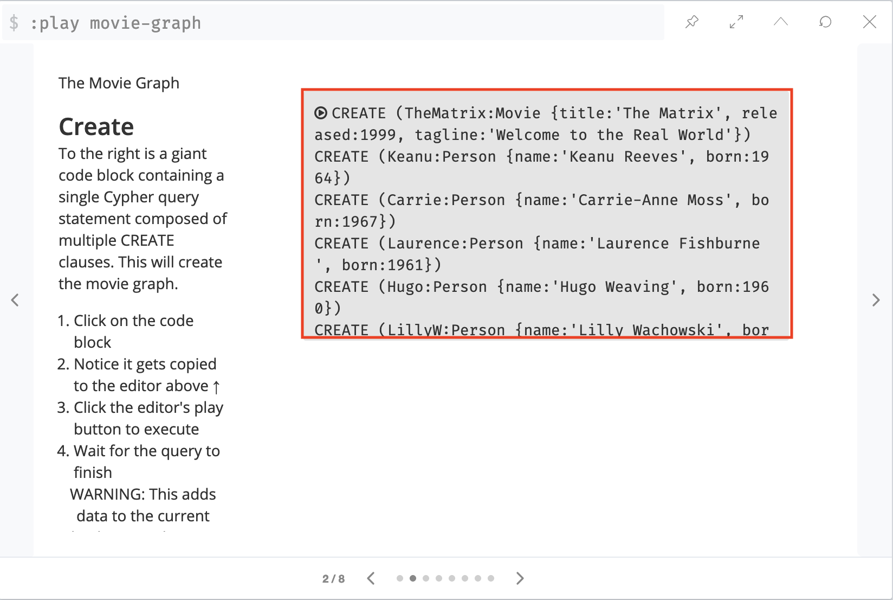

Let's hop into their nice portal that Neo4j provides. Open [http://localhost:7474](http://localhost:7474) in a browser. When asked to authenticate just choose the drop down "no authentication." If you didn't provide the no auth option on startup, the default username and password is neo4j/neo4j.

This lets you run queries from the browser and see visualizations!

The first thing that confused me was where to enter queries. I made a screenshot to show you but it's at the top in a text bar.



Click in that text area and then you can run queries there. Let's run a quick one to see everyone who acted in Scott Pilgrim vs the World.

```cql
MATCH (p:Person)-[:ACTED_IN]->(m:Movie)
WHERE m.title = "Scott Pilgrim vs the World"
RETURN p, m;
```



You get a nice little graph view of your nodes and relationships. You can also see everything as a table if that's better for your data.

Another very cool feature of the browser is it has some built in datasets that you can use to play around with the query features. They have a built in movie database so let's use that. Run the query from the browser (this won't work in cypher-shell)

```cql
:play movie-graph
```

This will pop up a little slide show that teaches some querying. Click the next arrow to get to the next page.



From there click on the query in the middle of the page.



Lastly, quick the run button in the query area


This will insert a lot of movies and people into your database. Alternatively, [here is a link][sample] to the same query you can copy / paste into either the browser or cypher-shell. It should be the exact same data so no need to do both.

[sample]: https://btholt.github.io/complete-intro-to-databases/sample-neo4j.cql
